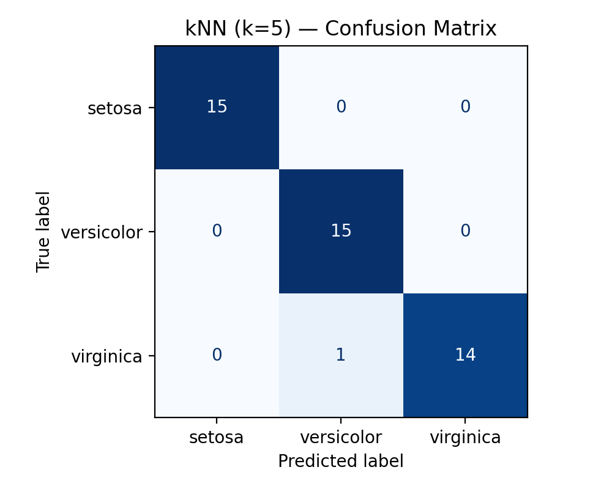
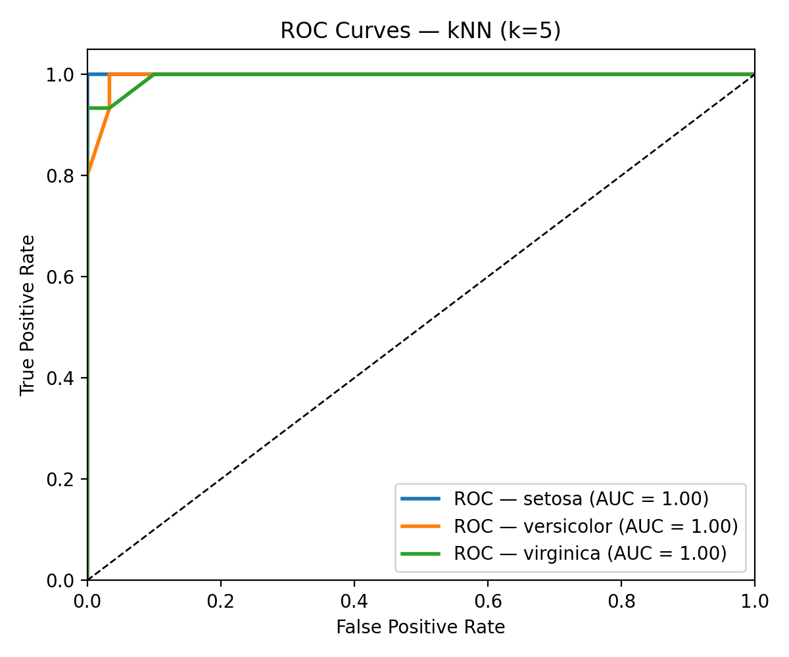

# Machine Learning Project: kNN Evaluation on Iris (k=5)

This project trains a **k-Nearest Neighbors (k=5)** classifier on the **Iris** dataset  
and evaluates performance using **confusion matrix**, **classification report** (accuracy, precision, recall, F1),  
and **ROC curves with AUC**.

---

## Student Info
- Name: Zahra Dastfal  
- Student ID: 700777425  

---

## How to Run
```bash
pip install scikit-learn matplotlib numpy
python ml_knn_evaluation.py

## Results

### Confusion Matrix


### ROC Curve


### Classification Report
